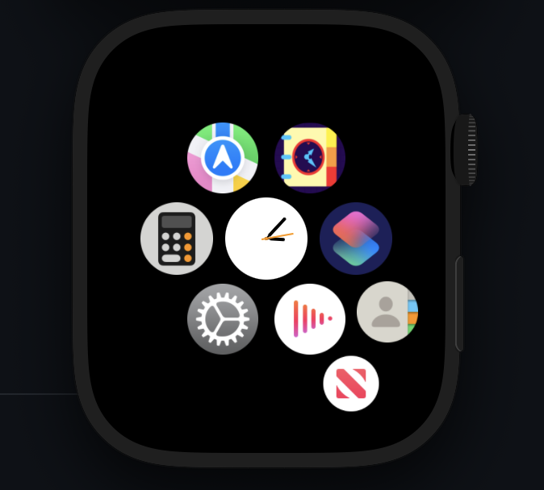
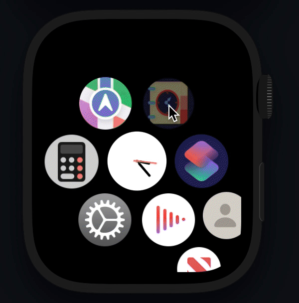
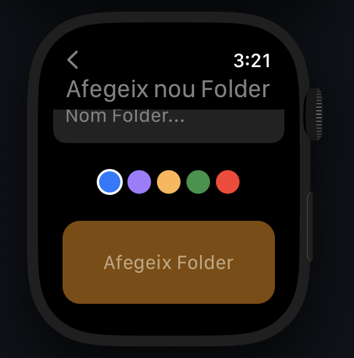
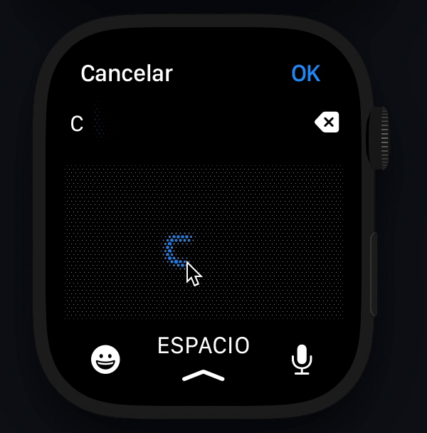
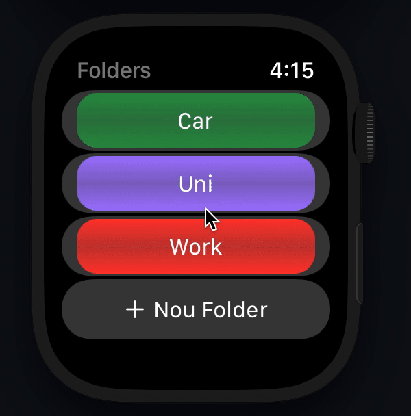
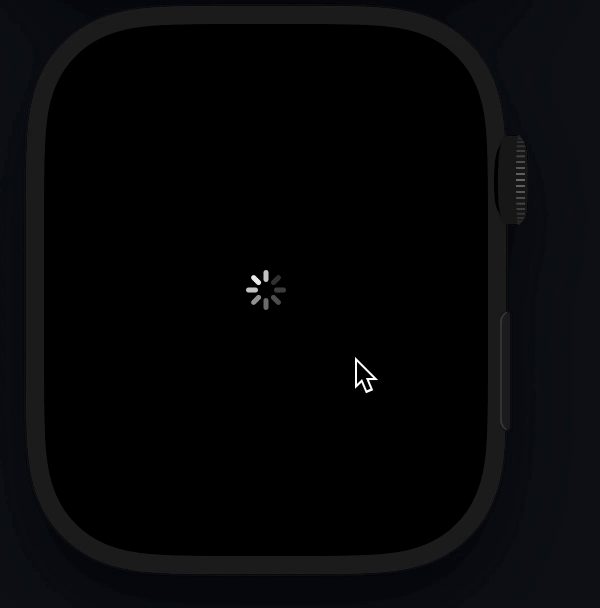
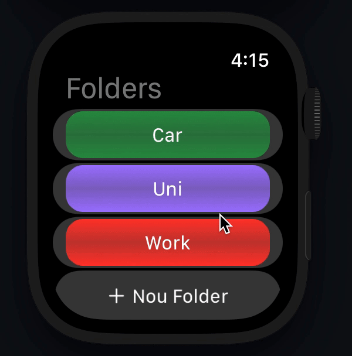

# iScheduleYourDay

<!--  -->

Currently developing an App for watchOS 8.5 to help order your tasks daily. The app is a simple approach to the actual Apple App Remainders to become an improved version of it

The purpose of this project is to understand the basis of **SwiftUI**, how to work with **CoreData**, and how to use the **WatchKit framework**.

## Tutorial

### Launching App

### Add new Folder

### Real Time adding new Folder

### Adding Todo

### From Home

## Persistence

**Note: Once close the app, the data is going to be saved on your watch. Therefore, if you relaunch the app all Folders and Todos are going to still be there, due to the implementation of the app persistence.**

---

## Future implementations:

* Notifications
* Add Time and Ubication on Tasks
* Add Members/Person Tags on Tasks
* Importation of new Tasks from Remainders
* Change this from a watch-only app, to a watchOS app with an iOS app
